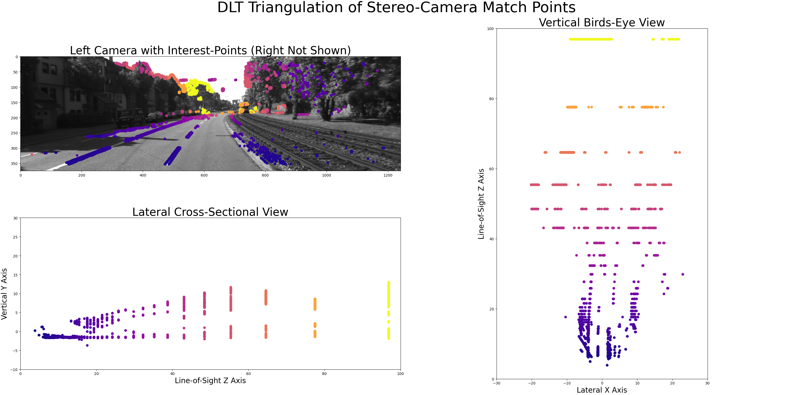
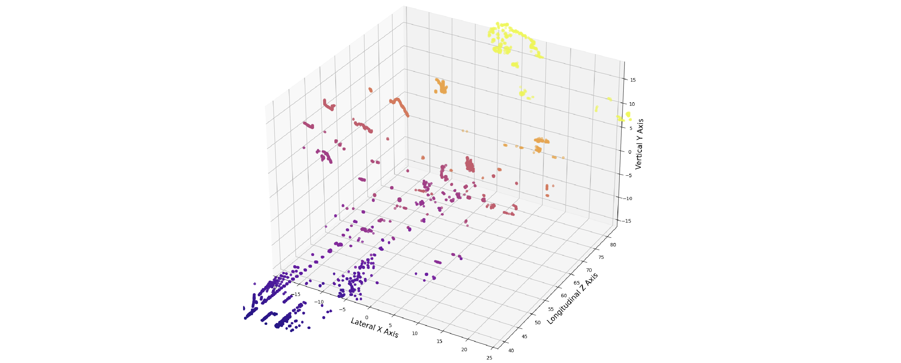

# Photogrammetric ComputerVision
A deep dive into classical and modern 3d Computer Vision techniques.

# DLT Triangulation of Point Pairs from KITTI Stereo Cameras

This Python script demonstrates DLT Triangulation (described by MVG) of corresponding image point-features between a pair of calibrated\synchronized cameras provided by the "KITTI Dataset".

Please watch: [Full Video Recordings on YT](https://pip.pypa.io/en/stable/)

Note how the triangulation resolution diminishes rapidly along the Line-of-Sight (Z axis).
Point color represents Z-Axis depth. 

## Installation:
Only `numpy, matplotlib, scipy, scikit-image, pytest` packages are required for this script.

To run within a virtual environment, create a separate virtual environment for the new project 

`python3 -m venv .venv` Specifying `.venv` as the directory for it.

`source .venv/bin/activate` Activate the virtual environment by sourcing the activate script.

`pip install -r requirements.txt` Install required packages

## Usage:
`pytest` Run Unit Tests

`python3 main_stereo_dlt_triangulation.py` Run DLT Triangulation over example image pair

`deactive` Deactivate Virtual Environment before closing terminal.

## Resources:
Geiger A, Lenz P, Stiller C, Urtasun R, _Vision meets Robotics: The KITTI Dataset_, International Journal of Robotics Research (IJRR), 2013, https://www.cvlibs.net/datasets/kitti/raw_data.php

Hartley R, Zisserman A,_Multiple View Geometry in Computer Vision_, 2003, Cambridge University Press, 2nd edition

Ma Y, Soatto S, Kosecká, J, & Sastry S S (2004). _An Invitation to 3-D Vision: From Images to Geometric Models_. Springer-Verlag.
