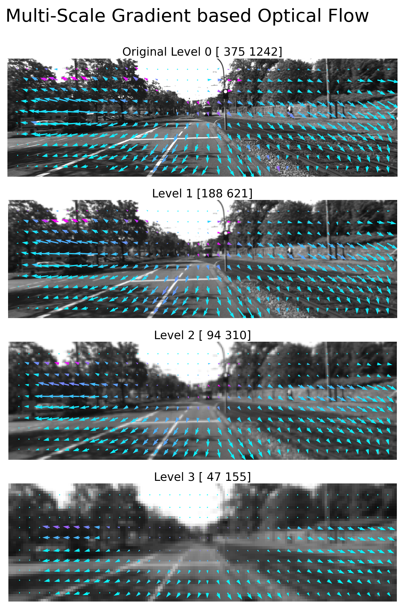

# Photogrammetric ComputerVision
A deep dive into classical & modern 3D Computer Vision concepts and techniques applied here to the calibrated\synchronized stereo camera imagery provided by the "KITTI Dataset"

## I. DLT Triangulation of Point Pairs from KITTI Stereo Cameras

DLT Triangulation (described by MVG) of corresponding image point-feature pairs.

Please watch: 
[Full Video Recordings on YouTube](https://www.youtube.com/watch?v=w3AwZM1RpVQ&list=PL9IYlUueNFoa8mLsTHtWhH6aflSdcyqWZ&index=1)

Note how the triangulation resolution diminishes rapidly along the Line-of-Sight (Z axis).
Point color represents Z-Axis depth. 

## II. Optical Flow from KITTI Camera Sequance

Optical Flow (described by Ma et al) of a fixed grid of points over a camera image sequence. 
It is Multi-Scale (i.e. recusrsively downsamples a pyramid of images) and applies Gradient based (Lucas and Kanade) computations. 

[Full Video Recordings on YouTube](https://www.youtube.com/watch?v=mm-BLc3SGRY&list=PL9IYlUueNFoa8mLsTHtWhH6aflSdcyqWZ&index=7)

## Installation:
Only `numpy, matplotlib, scipy, scikit-image, pytest` packages are required for this script.

To run within a virtual environment, create a separate virtual environment for the new project 

`python3 -m venv .venv` Specifying `.venv` as the directory for it.

`source .venv/bin/activate` Activate the virtual environment by sourcing the activate script.

`pip install -r requirements.txt` Install required packages

## Usage:
`pytest` Run Unit Tests

`python3 main_stereo_dlt_triangulation.py` Run DLT Triangulation over example image pair

`python3 main_optical_flow.py` Run Optical Flow over example image pair

`deactive` Deactivate Virtual Environment before closing terminal.

## Resources:
Geiger A, Lenz P, Stiller C, Urtasun R, _Vision meets Robotics: The KITTI Dataset_, International Journal of Robotics Research (IJRR), 2013, https://www.cvlibs.net/datasets/kitti/raw_data.php

Hartley R, Zisserman A,_Multiple View Geometry in Computer Vision_, 2003, Cambridge University Press, 2nd edition

Ma Y, Soatto S, Kosecká, J, & Sastry S S (2004). _An Invitation to 3-D Vision: From Images to Geometric Models_. Springer-Verlag.

Qian-Yi Zhou and Jaesik Park and Vladlen Koltun, _{Open3D}: {A} Modern Library for {3D} Data Processing_, arXiv:1801.09847, 2018

Torralba, A. and Isola, P. and Freeman, W.T. _Foundations of Computer Vision_, 2024, Adaptive Computation and Machine Learning series, MIT Press, https://mitpress.mit.edu/9780262048972/foundations-of-computer-vision/
