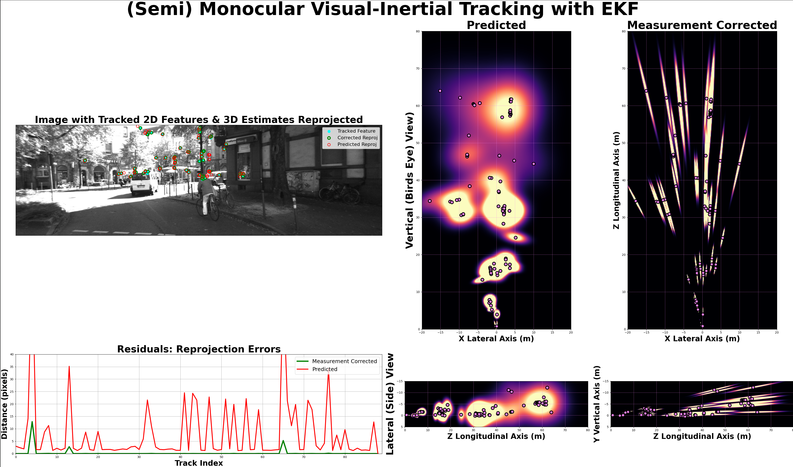
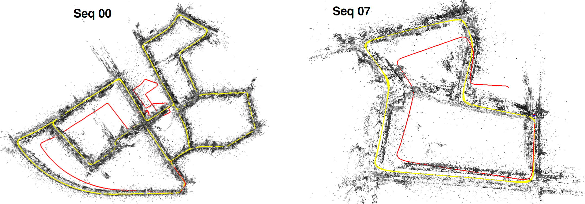

# Photogrammetric ComputerVision
A deep dive into classical & modern 3D Computer Vision concepts and techniques applied to the world famous stereo camera "KITTI Dataset"

## I. (Semi) Monocular Visual Inertial Tracking with EKF
Please see the [VIT-EKF README](VIT_EKF/README.md) for **full description** of the filter.

[Full Video Recordings on YouTube](https://www.youtube.com/watch?v=qI3MzEmzQrs&list=PL9IYlUueNFoa8mLsTHtWhH6aflSdcyqWZ&index=1)

The 3D coordinates of visual features are triangulated and tracked (in the camera Ego-Frame) with an EKF. Hence, each track is a _3D Gaussian distribution_: a (3,1) mean $\mu$ and (3,3) covariance $\Sigma$.
- The Prediction Step extrapolates the Track-Distribution using IMU-derived forward\lateral translation & yaw\pitch rotation. 
- The Measurement-Correction Step applies the Jacobian of the (normalized non-homogenous) Camera Projection (i.e. Measurement) model. 

    

## II. DLT Triangulation of Point Pairs from KITTI Stereo Cameras

Please watch: 
[Full Video Recordings on YouTube](https://www.youtube.com/watch?v=w3AwZM1RpVQ&list=PL9IYlUueNFoa8mLsTHtWhH6aflSdcyqWZ&index=1)

DLT Triangulation (described by MVG) of corresponding image point-feature pairs ($$(x,y), (x',y')$$), using 3x4 Camera Matrix pair $$\mathbf{P}, \mathbf{P}'$$, where $$\mathbf{P}^i$$ is the $$i^{th}$$ row.
The (4x1 Homogenous) solution is the unit singular vector corresponding to the smalest singular value of (6x4) matrix $$A$$.

$$
A = \begin{bmatrix}
x\mathbf{p}^{3T} - \mathbf{p}^{1T} \\
y\mathbf{p}^{3T} - \mathbf{p}^{2T} \\
x\mathbf{p}^{2T} - y\mathbf{p}^{1T} \\
x'\mathbf{p'}^{3T} - \mathbf{p'}^{1T} \\
y'\mathbf{p'}^{3T} - \mathbf{p'}^{2T} \\
x'\mathbf{p'}^{2T} - y'\mathbf{p'}^{1T}
\end{bmatrix}
$$

The math is implemented from scratch with `numpy` in `main_stereo_dlt_triangulation.py`

    

    

Note how the triangulation resolution diminishes rapidly along the Line-of-Sight (Z axis).
Point color represents Z-Axis depth. 

## III. Optical Flow from KITTI Camera Sequance

[Full Video Recordings on YouTube](https://www.youtube.com/watch?v=mm-BLc3SGRY&list=PL9IYlUueNFoa8mLsTHtWhH6aflSdcyqWZ&index=7)

Optical Flow (described by Ma et al) of a fixed grid of points over a camera image sequence. 
It is Multi-Scale (i.e. recursively downsamples a pyramid of images) and applies Gradient based (Lucas and Kanade) computations. 

A least squares solution to pixel velocity (which fulfills the "Brightness Constancy Constraint") is given by

$$u = -G^{-1}\mathbf{b}$$

where spatial $I_x, I_y$ and temporal $I_t$ image gradients are applied as 

$$
G = \begin{bmatrix}
\Sigma I^{2}_{x},   \Sigma I_{x} I_{y} \\
\Sigma I_{y} I_{x}, \Sigma I^{2}_{y} 
\end{bmatrix}
, 
\mathbf{b} = \begin{bmatrix}
\Sigma I_{x} I_{t} \\
\Sigma I_{y} I_{t}  
\end{bmatrix}
$$

The math is implemented from scratch with `numpy` is `main_optical_flow.py`

    

## Installation:
Only `numpy, matplotlib, scipy, scikit-image, pytest` packages are required for this script.

To run within a virtual environment, create a separate virtual environment for the new project 

`python3 -m venv .venv` Specifying `.venv` as the directory for it.

`source .venv/bin/activate` Activate the virtual environment by sourcing the activate script.

`pip install -r requirements.txt` Install required packages

## Usage:
`pytest` Run Unit Tests

`python3 main_visual_inertial_tracking_EKF.py` Run the Visual-Inertial-Tracking EKF

`python3 main_stereo_dlt_triangulation.py` Run DLT Triangulation over example image pair

`python3 main_optical_flow.py` Run Optical Flow over example image pair

`deactive` Deactivate Virtual Environment before closing terminal.

## ORB-SLAM2 from Universidad de Zaragoza (Raúl Mur-Artal et al)
- **Original Project Page**: https://webdiis.unizar.es/~raulmur/orbslam/
- **Original Code**: https://github.com/raulmur/ORB_SLAM2

Please watch: 
[My ORB-SLAM2 Stereo-KITTI Outputs on YouTube](https://www.youtube.com/watch?v=-Z-bCY-UboU&list=PL9IYlUueNFoa8mLsTHtWhH6aflSdcyqWZ&index=10)

Several minor tweaks were made to run on: 
- Ubuntu 24.04.4, C++ 14, opencv 4.6.0, eigen3 3.4.0, Pangolin 0.9.5

Apply `refactor_for_upgraded_deps_ORBSLAM2.patch` to your cloned ORB-SLAM2 repo to run locally.

ORB-SLAM computes in real-time the camera trajectory and sparse 3D scene reconstruction for Monocular, Stereo, and RGB-D Cameras. 
It is Keypoint (ORB feature) based, and employs Bundle-Adjustment to close large loops.

Unlike Monocular-SLAM, the Stereo-SLAM estimates the map and trajectory with metric scale and does not suffer from scale drift. 
See below how Stereo ORBSLAM approaches the Loop Closure point with perfect accuracy, while the Monocular ORBSLAM has accumulated significant drift.

Both Mono and Stereo detect the Loop Closure and refine the total Map via Bundle Adjustment upon detection.

## Direct-Sparse-Odometry with Loop Closure (LDSO) from Technical University Munich (Gao, Engel, Cremers et al)

- **Original Project Page**: https://cvg.cit.tum.de/research/vslam/ldso
- **Original Code**: https://github.com/tum-vision/LDSO

Please watch: 
[My LDSO KITTI Outputs on YouTube](https://www.youtube.com/watch?v=la80GUIY9Ms&list=PL9IYlUueNFoa8mLsTHtWhH6aflSdcyqWZ&index=12)

Few minor tweaks were made to run on:

    Ubuntu 24.04.4, C++ 14, opencv 4.6.0, eigen3 3.4.0, Pangolin 0.9.5

Apply `refactor_for_upgraded_deps_LDSO.patch` to your cloned LDSO repo to run locally.

LDSO employs 

- the original DSO [1] as a camera tracking front-end 
- an additional Loop-Closure-Detection and Pose-Graph Optimization as a back-end.

See below the difference between the Trajectory before (red line) and after (yellow line) Loop-Detection & Global Optimization.

As a monocular SLAM, it accumulates drift\error in the unobservable degrees-of-freedom; i.e. global translation, rotation and scale
Upon Loop Closure detection, this accumulated error is resolved by a global Pose-Graph Optimization.
Nonetheless, as a Monocular SLAM, scale is still ambiguous\unobservable. This is not the case in Stereo ORB-SLAM2 shown previously.

## Resources:
Geiger A, Lenz P, Stiller C, Urtasun R, _Vision meets Robotics: The KITTI Dataset_, International Journal of Robotics Research (IJRR), 2013, https://www.cvlibs.net/datasets/kitti/raw_data.php

Hartley R, Zisserman A,_Multiple View Geometry in Computer Vision_, 2003, Cambridge University Press, 2nd edition

Ma Y, Soatto S, Kosecká, J, & Sastry S S (2004). _An Invitation to 3-D Vision: From Images to Geometric Models_. Springer-Verlag.

Qian-Yi Zhou and Jaesik Park and Vladlen Koltun, _{Open3D}: {A} Modern Library for {3D} Data Processing_, arXiv:1801.09847, 2018

Raúl Mur-Artal, and Juan D. Tardós.
_ORB-SLAM2: an Open-Source SLAM System for Monocular, Stereo and RGB-D Cameras_
ArXiv preprint arXiv:1610.06475, 2016.

Raúl Mur-Artal, J. M. M. Montiel and Juan D. Tardós.
_ORB-SLAM: A Versatile and Accurate Monocular SLAM System._
IEEE Transactions on Robotics, vol. 31, no. 5, pp. 1147-1163, October 2015.
(2015 IEEE Transactions on Robotics Best Paper Award)

J. Engel, V. Koltun, and D. Cremers, _Direct Sparse Odometry_, IEEE Transactions on Pattern Analysis and Machine Intelligence, vol. 40,
no. 3, pp. 611–625, 2018

X. Gao, R. Wang, N. Demmel, and D. Cremers, _LDSO: Direct Sparse Odometry with Loop Closure_, iros, 2018, October

Torralba, A. and Isola, P. and Freeman, W.T. _Foundations of Computer Vision_, 2024, Adaptive Computation and Machine Learning series, MIT Press, https://mitpress.mit.edu/9780262048972/foundations-of-computer-vision/
