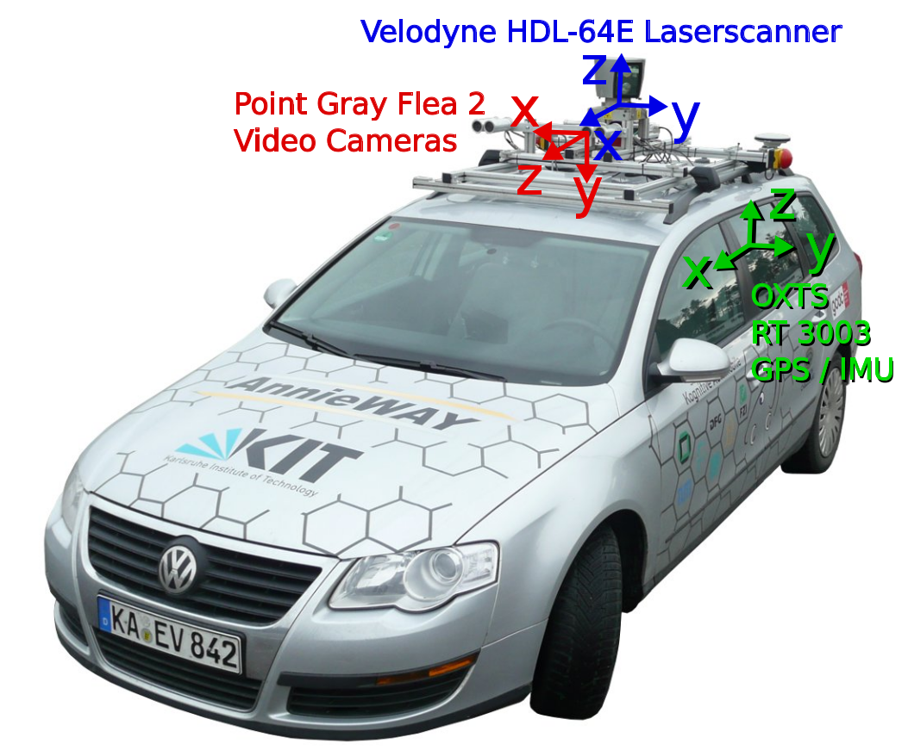
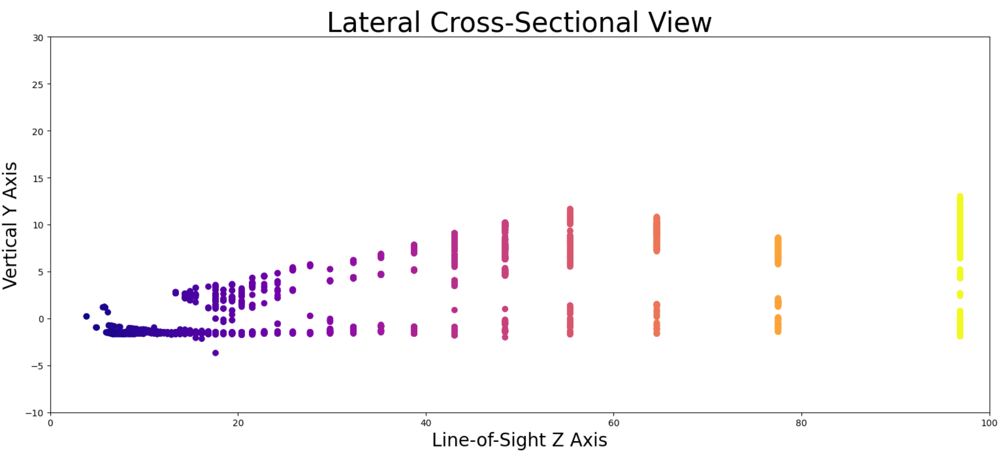
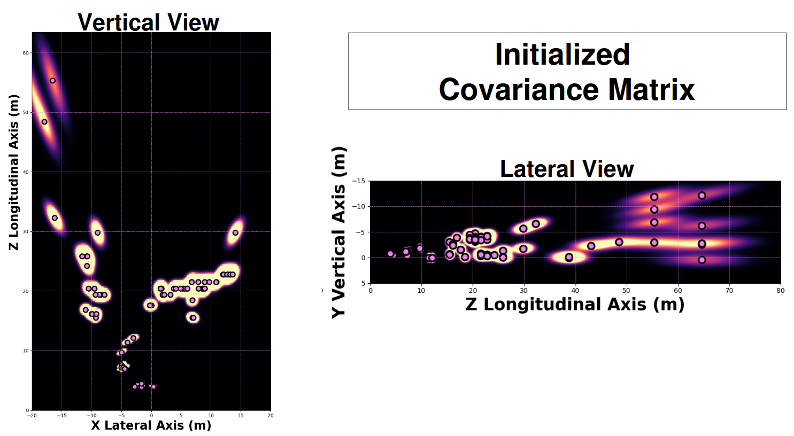
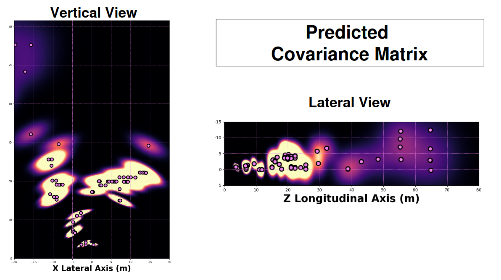
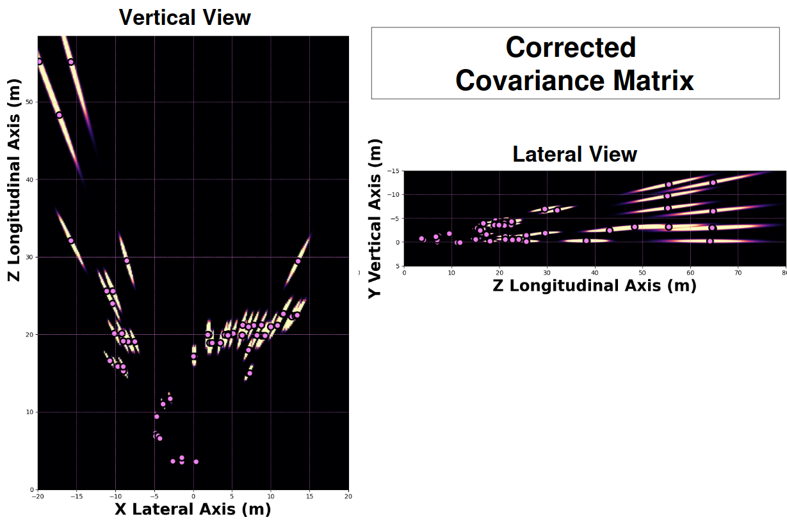
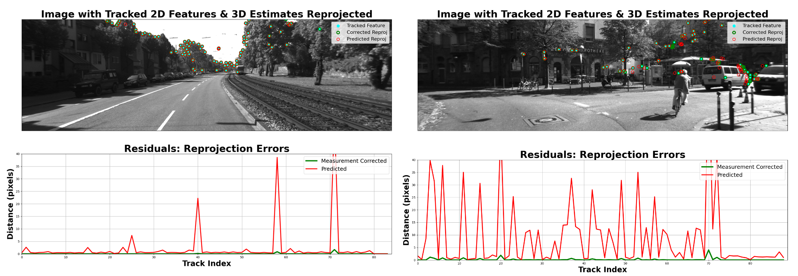

# (Semi) Monocular Visual-Inertial-Tracking with EKF

Please watch Full Video Recordings on YT.

**Summary:** 
Given the KITTI stereo-camera dataset, **track the 3D position of points** in the **local frame of the Left Camera**.
The track positions **initialize** as triangulation between Left\Right cameras.
However, the track positions are Measurement-Corrected over time using **only** the left camera.
Hence, this algorithm is labelled "***(Semi)** Monocular*".

    

**Fig 1**: KITTI Recording Platform *(Geiger et al, 2013)*

## I. Feature Detection, Initialization, & Tracking
Features in Left Camera are detected via **Shi-Tomasi Corner Detection** provided by `cv2.goodFeaturesToTrack`.
The optimal matching pixel coordinate is found in the Right Camera via `ski.feature.match_template()`. 
The Each pixel coordinate pair is (with the calibrated Left & Right 3x4 camera matrices) triangulated via `cv2.triangulatePoints()`. 
The results are in meters.
The (moving) Left Camera is the Origin coordinate system defined as: 

`x = right, y = down, z = forward`. 

Features are tracked over successive frames via **Lukas-Kanade Optical Flow** provided by `cv2.calcOpticalFlowPyrLK()`.
A new feature is initialized each time a feature leaves the field of view, or is lost by the tracker.

## 2. State Space & Prediction Step
Each tracked point is represented as **3-D Gaussian Distribution**

$\mu = \begin{bmatrix} \mu_x \\ \mu_y \\ \mu_z \end{bmatrix}$, 
$\Sigma = \begin{bmatrix} \sigma_x^2 & \sigma_{xy} & \sigma_{xz} \\ \sigma_{yx} & \sigma_y^2 & \sigma_{yz} \\ \sigma_{zx} & \sigma_{zy} & \sigma_z^2 \end{bmatrix}$

### 2.1 Initialize Track Covariance Matrix
Triangulation accuracy is highly **quantized** along the Z-axis with rapidly decreasing resolution.

    

**Fig 2**: Quantization of Depth Resolution Degrades Rapidly along Line-of-Sight $z$*

For the KITTI Camera, this variance as a function of depth $z$ is:

$\sigma_z^2 = \frac{z^4 \sigma_{\text{pix}}^2}{387.5744^2}$

The Yaw\Pitch line-of-sight angles of a pixel are:
$\theta_\text{yaw} = \tan^{-1}\left(\frac{x}{z}\right)$ and $\theta_\text{pitch} = \tan^{-1}\left(\frac{y}{z}\right)$
So, the variance along the (off-center) line-of-sight becomes:

$\sigma_z^2 = \frac{z^4 \sigma_{\text{pix}}^2}{387.5744^2 \cos{\theta_\text{yaw}} \cos{\theta_\text{pitch}}}$

Assuming $\sigma_x^2 = \sigma_y^2 = \sigma_z^2/100.0$, then:

$\Sigma = \begin{bmatrix} \sigma_x^2 & 0.0 & 0.0 \\ 0.0 & \sigma_y^2 & 0.0 \\ 0.0 & 0.0 & \sigma_z^2 \end{bmatrix}$

can be rotated into the **pixel LoS**:
$\Sigma_\text{initial} = R_x R_y \Sigma R_y^T R_x^T$

Below are initialized covariance matrices of each Track.

    

**Fig 3**: Initialized Track Covariances are rotated into the pixel Line-of-Sight

### 2.2 Prediction Step
The camera undergoes translation along $z$ (forward) and $x$ (lateral) axes, and undergoes rotation about $y$ (yaw) and $x$ (pitch) axes.
These are "control inputs", and are applied to the points in the following **State Transition Model**

$$
    \mu_{\text{predicted}} = R_x R_y (\mu - \delta_\text{shift})
$$

$\mu_{\text{predicted}} = \begin{bmatrix} 1.0 & 0.0 & 0.0 \\ 0.0 & \cos(\delta_\text{pitch}) & -\sin(\delta_\text{pitch}) \\ 0.0 & \sin(\delta_\text{pitch}) & \cos(\delta_\text{pitch}) \end{bmatrix} \begin{bmatrix} \cos(\delta_\text{yaw}) & 0.0 & \sin(\delta_\text{yaw}) \\ 0.0 & 1.0 & 0.0 \\ -\sin(\delta_\text{yaw}) & 0.0 & \cos(\delta_\text{yaw}) \end{bmatrix} \left( \begin{bmatrix} \mu_x \\ \mu_y \\ \mu_z \end{bmatrix} - \begin{bmatrix} \delta_x \\ 0.0 \\ \delta_z \end{bmatrix} \right)$

The predicted Covariance Matrix is

$$
    \Sigma_\text{predicted} = R_x R_y \Sigma R_y^T R_x^T + Q
$$

### 2.3 Compute Process Noise $Q$
Transforming the covariance of control inputs into state-space via:

$Q = J_Q \Sigma_U J_Q^T$

where $\Sigma_U$ is the covariance of control inputs

$\Sigma_U = \begin{bmatrix} \sigma_{\delta x}^2 & 0.0 & 0.0 & 0.0 \\ 0.0 & \sigma_{\delta z}^2 & 0.0 & 0.0 \\ 0.0 & 0.0 & \sigma_{\delta \text{yaw}}^2 & 0.0 \\ 0.0 & 0.0 & 0.0 & \sigma_{\delta \text{pitch}}^2 \end{bmatrix}$

(the values are estimated as per Motion Model in *Probabilistic Robotics by Thrun et al*)

and $J_Q$ is the Jacobian of the State-Transition-Model with respect to the Control Parameters
$J = \begin{bmatrix} -1.0 & 0 & -1.0 \cdot \delta_z + 1.0 \cdot \mu_z & 0 \\ 0 & 0 & 0 & \delta_z - \mu_z \\ 0 & -1 & \delta_x - \mu_x & 1.0 \cdot \mu_y \end{bmatrix}$

(assuming $\delta_\text{yaw} = \delta_\text{pitch} = 0.0$ for simplicity)

As expected, the Predicted Covariance matrix $\Sigma_\text{pred}$ _diffuses_ along the camera yaw\pitch angles. 

    

**Fig 4**: Predicted\Extrapolated Covariances injects noise due to motion variance in $\delta$ forward\right\yaw\pitch.

i.e. noise in camera yaw\pitch adds uncertainty horizontally\vertically and increasingly so as a function of point distance $z$ (_like a lever-arm_).

## III. Camera-Projection Model & Correction Step
### 3.1 Compute Jacobian of Projection Model $H$
The standard Homogenous Camera projection is given as:

$PX = \begin{bmatrix} f_x & 0.0 & p_x & 0.0 \\ 0.0 & f_y & p_y & 0.0 \\ 0.0 & 0.0 & 1.0 & 0.0 \end{bmatrix}$ $\begin{bmatrix} x \\ y \\ z \\ 1 \end{bmatrix}$

We reduce it to 2x3 to match our non-homogenous state\measurement spaces, and include the normalization by $z$:

$PX = \begin{bmatrix} \frac{f_x}{Z} & 0.0 & \frac{c_x}{Z} \\ 0.0 & \frac{f_y}{Z} & \frac{c_y}{Z} \end{bmatrix}$ $\begin{bmatrix} x \\ y \\ z\end{bmatrix}$

The normalization makes this a **non-linear model**, and hence it must be linearized into a Jacobian for usage in the Measurement-Correction step.

$$
    \boxed{H = \begin{bmatrix} \frac{f_x}{Z} & 0.0 & -\frac{f_x \cdot X}{Z^2} \\ 0.0 & \frac{f_y}{Z} & -\frac{f_y \cdot Y}{Z^2} \end{bmatrix}}
$$

This "Projection Jacobian" is the **key** to the Measurement Correction, as shown below.
### 3.2 Measurement Correction of Prediction
Given:

**Tracked Feature** $f_i$

**Kalman Gain** $K = \Sigma_\text{pred}H^T (H\Sigma_\text{pred}H^T + R)$,

the optimal\corrected track distribution becomes:

$$
    \mu_\text{corrected} = \mu_\text{pred} + K (f_i - P_\text{Left}\mu_\text{pred})
$$

$$
   \Sigma_\text{corrected} = (I-KH)\Sigma_\text{pred}(I-KH)^T + KRK^T  
$$

As expected, the Measurement Corrected Covariance matrices $\Sigma_\text{corrected}$ appear as _needles_ along the pixel _line-of-sight_.

    

**Fig 5**: Measurement Corrected Covariances are "sharpened" along the pixel Line-of-Sight due to Projection-Jacobian $H$

i.e. Cameras isolate objects in _angle_, but not in _range_.

## IV. Results
The VIT-EKF runs successfully.
The performance of the VIT-EKF is evaluated according to the Pre and Post Measurement-Correction "Reprojection Error". i.e.

$\epsilon_\text{predicted} = f_i - P_\text{Left}\mu_\text{predicted}$

$\epsilon_\text{corrected} = f_i - P_\text{Left}\mu_\text{corrected}$

The **Innovation** or **Pre-Fit Residual** $\epsilon_\text{pred}$ *drives* the predicted state towards the measurement corrected state via the **Kalman Gain**

The reprojection of 3D points which undergo IMU-based Prediction Model "track" their 2D features with remarkable accuracy. 
However, due to triangulation, and IMU errors, predicted points do carry and accrue significant reprojection errors.

The Measurement-Correction consistently and significantly reduced these reprojection errors most often to zero pixels, but not always. e.g.
 
- In City_0001, the camera follows a straight line with simple and distant 3D features. 
- In City0005, the camera rotates often with complex nearby 3D features.

    

**Fig 6**: Predicted Track Reprojection always exceed Corrected Track Reprojection. 

Clearly, City_0005 experiences more reprojection error (particularly Pre-Fit), but does manage to reduce errors to near zero in Post-Fit.

**Main Issue Observed**

2D Features do not always "exit" the field-of-view neatly.
The Feature-Tracking algorithm stubbornly re-assigns the track to nearby similar features rather than labelling it "gone". 

## V. Conclusions, Open Points, & Follow-Up Steps

The main "contribution\discovery" of this mini-project is the Jacobian of the (normalized non-homogenous) camera projection model: 
$$
    \boxed{H = \begin{bmatrix} \frac{f_x}{Z} & 0.0 & -\frac{f_x \cdot X}{Z^2} \\ 0.0 & \frac{f_y}{Z} & -\frac{f_y \cdot Y}{Z^2} \end{bmatrix}}
$$

This Jacobian enables any Kalman Filter to incorporate visual features into it's Measurement-Correction step.

The Prediction-Model assumes _stationary objects_ seen from a moving camera.
Nonetheless, the `VIT-EKF` successfully _tracks moving objects_ due to the measurement correction (even though the Predicted (Pre-Fit) Residual would be large).
This Pre\Post-Fit Residual difference can be exploited to _identify moving objects_.

Two natural extensions of this effort are to 
- **Full Monocular** Initialize the track distances arbitrarily e.g. 50m, and see if they can converge to their true positions over numerous timesteps.
- **Full Stereo** Track the features in the right image as well, and include **both Left & Right reprojection errors** into the Measurement-Correction steps. How to include correlation between these two observations?